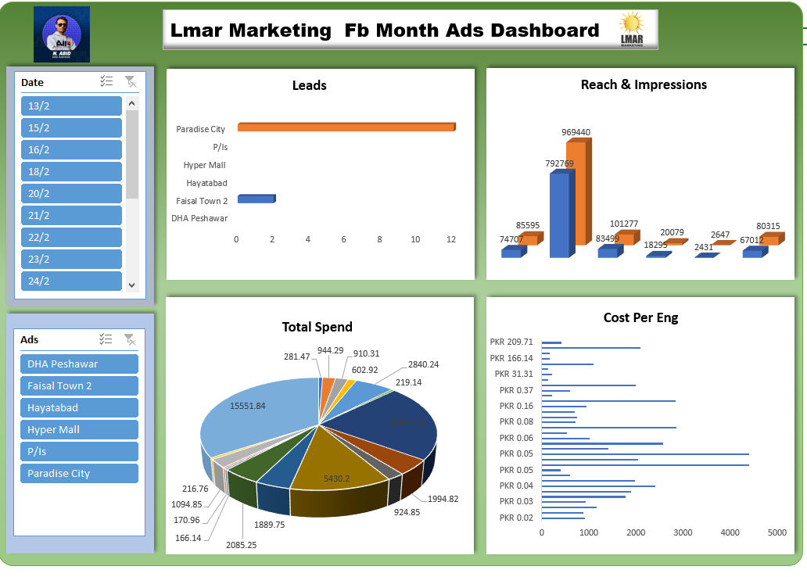

# LMAR Marketing Dashboard

## 📊 Overview
This project analyzes marketing performance data from LMAR Marketing, focusing on ads, reach, impressions, engagement, and total spend.

## 🎯 Objectives
- Analyze ads performance
- Track marketing spend
- Measure engagement and leads

## 🏢 Company
LMAR Marketing

## 🧾 Dataset Includes
- Ads
- Awareness
- Engagement
- Leads
- Reach
- Impressions
- Messages
- Cost Per
- Total Spend

## 🛠 Tools Used
- MS Excel

## 📈 Key Insights
- Faisal Town 2 shows strong engagement performance
- Some campaigns have high cost but low reach
- Marketing performance varies across locations

## 📷 Dashboard Preview

## 🚀 Author
Learn with Deep Data Lab
